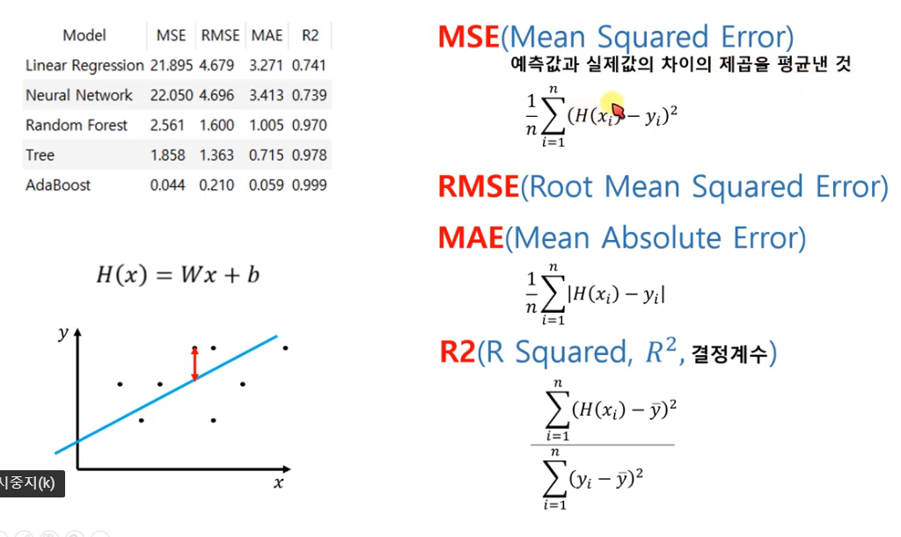

# 오렌지 절차
```
    [1단계] 문제 설정

    [2단계] 데이터 수집

    [3단계] 데니처 관찰 및 정제
        파일오픈 -> 데이터 적제 -> 데이터 확인

    [4단계] 머신러닝 모델 설정 및 학습
        모덜 선택

    [5단계]테스트 데이터 입력 및 예측
        테스트 파일 오픈 => 에측 -> 데이터 확인

    [6단계] 평가
        k-fold cross validation( 교차검증 )

    [7단계] 배포
```
## 용어
```
    
```


### 절차
```
    데이터 준비
        수집 -> DB적재 -> data 정제
        
    모델 구성
        추가변수 개발 -> 최종변수 정의

    모델 준비 OR 선정
        지도학습
            회귀, 분류

        비지도학습
            세그먼트

    모델 학습
        지도학습
            후보모델 성능평가

        비지도학습    
            통계량 분석

    모델 평가
        지도학습
            튜닝

        비지도학습    
            프로파일링 정의

    에측   
```